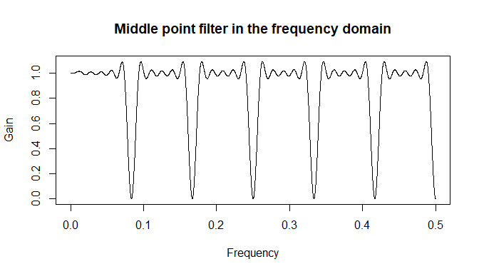

<!-- README.md is generated from README.Rmd. Please edit that file -->

# deseats 

<!-- badges: start -->

[](https://cran.r-project.org/package=deseats)
[](https://cran.r-project.org/package=deseats)
[](https://cran.r-project.org/package=deseats)
[](https://cran.r-project.org/web/licenses/GPL-3)
<!-- badges: end -->

The goal of deseats is to provide several methods to decompose seasonal
time series. Among them is a new fully data-driven algorithm called
DeSeaTS (deseasonalize time series) for locally weighted regression with
an automatically selected bandwidth. DeSeaTS accounts for possible
short-range dependence in the underlying error process. Furthermore, the
base model of the BV4.1 (Berlin Procedure 4.1) can be considered as
well. Permission to include the BV4.1 base model procedure was kindly
provided by the Federal Statistical Office of Germany.

## Installation

You can install the current version of the package from CRAN with:

``` r
install.packages("deseats")
```

## Examples

### Basic decomposition

This is a basic example which shows you how to decompose a seasonal time
series using the DeSeaTS algorithm:

``` r
library(deseats)

### Locally weighted regression with automatically selected bandwidth
### (here: local cubic trend)
est <- deseats(NOLABORFORCE, set_options(order_poly = 3))
est@bwidth     # The automatically selected bandwidth
#> [1] 0.1968428

### Plot of the results
plot(est, which = 1, xlab = "Year")
```


### Seasonal adjustment

A seasonal adjustment can subsequently be easily achieved using
implemented methods.

``` r
adj <- deseasonalize(est)
plot(adj, xlab = "Year", main = "The seasonally adjusted series")
```


### Forecasting

If a decomposition via the DeSeaTS algorithm is suitable, the residual
series can be further analyzed using autoregressive moving-average
(ARMA) models.

``` r
model <- s_semiarma(NOLABORFORCE, set_options(order_poly = 3))
model
#> 
#> *******************************************
#> *                                         *
#> *        Fitted Seasonal Semi-ARMA        *
#> *                                         *
#> *******************************************
#> 
#> Series: NOLABORFORCE
#> 
#> Nonparametric part (Trend + Seasonality):
#> -----------------------------------------
#> 
#>  Kernel:    Epanechnikov
#>  Boundary:  Extend
#>  Bandwidth: 0.1968
#> 
#>   Trend:
#>   ------
#>     Order of local polynomial: 3
#> 
#>   Seasonality:
#>   ------------
#>     Frequency: 12
#> 
#> Parametric part (Rest):
#> -----------------------
#> 
#> Call:
#> stats::arima(x = res, order = c(ar, 0, ma), include.mean = arma_mean)
#> 
#> Coefficients:
#>          ar1
#>       0.6743
#> s.e.  0.0387
#> 
#> sigma^2 estimated as 0.07454:  log likelihood = -43.77,  aic = 91.54
```

The complete model can then be used for forecasting the seasonal time
series. Forecasting intervals can be obtained either through the
normality assumption or via a bootstrap.

``` r
fc <- predict(model, n.ahead = 12, method = "norm")
plot(fc, xlab = "Year", main = "A forecasting example")
```


### Filters in the frequency domain

The linear locally weighted regression filters can be quickly displayed
in the frequency domain.

``` r
fr <- seq(0, 0.5, 1e-04) # Frequencies
g_funs <- gain(est, lambda = fr) # Obtain correspondiong gain function values
g_deseas <- g_funs$gain_deseason # Gain function values for deseasonalization

l <- length(g_deseas[, 1])
weights_interior <- g_deseas[(l - 1) / 2 + 1, ] # middle point filter weights

plot(fr, weights_interior, type = "l", xlab = "Frequency", ylab = "Gain",
     main = "Middle point filter in the frequency domain")
```



### Interactive decomposition

The provided decomposition methods can also be applied interactively.
Run the following code.

``` r
runDecomposition()
```

This starts a shiny app which lets you load data files, decompose the
time series saved therein, and download the decomposed data.

## Main functions

The main functions of the package are:

- `deseats()`: locally weighted regression with automatically selected
  bandwidth for decomposition,

- `BV4.1()`: BV4.1 base model for decomposition,

- `lm_decomp()`: ordinary least squares for decomposition,

- `llin_decomp`: local linear regression for decomposition,

- `ma_decomp()`: moving averages for decomposition,

- `hamilton_filter()`: the time series filter by Hamilton.

The package, however, provides many other useful functions for you to
discover.

## Datasets

The package contains several seasonal example time series from official
sources.

## Authors

- Yuanhua Feng (Department Economics, Paderborn University, Germany)
  (Author)

- Dominik Schulz (Department Economics, Paderborn University, Germany)
  (Author, Maintainer)

## Contact

For questions, bug reports, etc., please contact the maintainer
Mr. Dominik Schulz via <dominik.schulz@uni-paderborn.de>.
